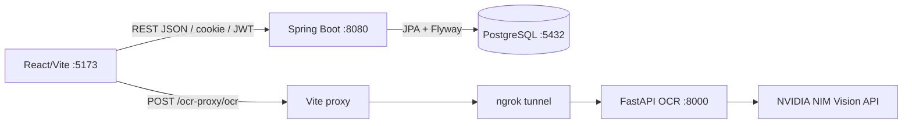

# Báo cáo phân tích hệ thống Admit Consult

**Ngày cập nhật:** 08/09/2026  
**Phạm vi:** Phân tích tĩnh mã nguồn hiện tại, kết hợp kiểm tra build, compile và một số API runtime.  
**Mục đích:** Tài liệu bàn giao kỹ thuật, mô tả kiến trúc, dữ liệu, luồng nghiệp vụ, bảo mật, vận hành và các điểm cần hoàn thiện.

## 1. Tổng quan sản phẩm

Admit Consult là nền tảng hỗ trợ học sinh Việt Nam trong quá trình lựa chọn ngành và trường đại học. Hệ thống tập trung vào chuỗi quyết định:

```text
Nhập điểm / OCR học bạ
        -> Tính điểm trung bình và tổ hợp
        -> So sánh điểm chuẩn các năm
        -> Tìm trường, ngành phù hợp
        -> Nhận tư vấn / thảo luận cộng đồng
```

### Nhóm người dùng

| Nhóm | Nhu cầu chính | Khu vực chức năng |
|---|---|---|
| Học sinh | Lưu điểm, xem điểm chuẩn, tìm ngành/trường, hỏi đáp | Học bạ, so sánh, trường, tư vấn, cộng đồng |
| Tư vấn viên | Xử lý yêu cầu tư vấn, đăng thông báo tuyển sinh | Dashboard tư vấn viên, forum |
| Quản trị viên | Quản lý user, advisor, nội dung và cấu hình | Dashboard quản trị |

### Mức độ hoàn thiện theo nghiệp vụ

| Nghiệp vụ | Trạng thái hiện tại |
|---|---|
| Nhập và lưu điểm thủ công | Đã có |
| OCR học bạ qua NVIDIA NIM | Đã có, phụ thuộc FastAPI/ngrok trong môi trường dev |
| Tính điểm trung bình từng môn | Đã có ở giao diện học bạ |
| Tính tổng điểm tổ hợp | Đã có ở trang so sánh |
| So sánh điểm chuẩn | Đã có, dữ liệu lấy từ backend |
| Tư vấn ngành | Có quiz và luật gợi ý tĩnh; chưa phải AI server-side thực sự |
| Forum | Đã có bài viết, reply, like, danh mục và ghim |
| Hồ sơ công khai | Đã có, phân biệt student/advisor |
| Quyền riêng tư điểm | Đã có ở backend và giao diện hồ sơ |
| Tư vấn trực tiếp | Có consultation và chat/message |

## 2. Quy mô và công nghệ

Số liệu được đếm từ workspace hiện tại:

| Thành phần | Số lượng / công nghệ |
|---|---|
| Backend source | 93 file Java |
| Frontend source | 54 file TypeScript/TSX |
| Trang frontend | 17 page component |
| REST controller | 17 controller |
| JPA entity | 22 entity |
| Backend | Spring Boot 3.4.5, Spring Web, Spring Security, Spring Data JPA |
| Ngôn ngữ backend | Java, Maven; `pom.xml` đặt Java 21 |
| Frontend | React 19, Vite 8, TypeScript 6 |
| UI | Tailwind CSS v4, component tự xây dựng, lucide-react |
| Cơ sở dữ liệu | PostgreSQL, Hibernate/JPA, Flyway |
| OCR | FastAPI + NVIDIA NIM vision model trong môi trường dev |
| Bản đồ | React Leaflet / OpenStreetMap iframe |

Tài liệu sản phẩm nằm ở [PRODUCT.md](../PRODUCT.md). Quy ước vận hành và lệnh chạy nằm ở [AGENTS.md](../AGENTS.md).

## 3. Kiến trúc tổng thể

### 3.1. Mô hình triển khai hiện tại



**Bằng chứng trong mã nguồn:**

| Nhận định | Vị trí trong code | Ý nghĩa runtime |
|---|---|---|
| Frontend gọi API local ở development và `/api` khi production | [web/src/lib/api.ts](../web/src/lib/api.ts#L1-L2) | `API_BASE` là `http://localhost:8080/api` khi chạy dev; khi build production, request dùng `/api`. |
| OCR không đi qua Spring Boot trong dev | [web/vite.config.ts](../web/vite.config.ts#L13-L21) | Vite đăng ký proxy `/ocr-proxy`, rewrite bỏ prefix và chuyển request tới URL ngrok. |
| Backend là ứng dụng Spring Boot | [BackendApplication.java](../backend/src/main/java/com/admitconsult/BackendApplication.java#L6-L9) | `@SpringBootApplication` bật component scan, auto-configuration và khởi động toàn bộ controller/service/repository. |
| Database dùng JPA validation | [application.properties](../backend/src/main/resources/application.properties#L9-L9) | `ddl-auto=validate` khiến Hibernate kiểm tra schema, không tự tạo/sửa bảng. |
| Migration do Flyway quản lý | [application.properties](../backend/src/main/resources/application.properties#L14-L17) | Flyway đọc migration từ `classpath:db/migration` khi backend khởi động. |

Trong local, browser gọi Spring Boot qua `http://localhost:8080/api`. Riêng OCR đi theo nhánh khác: browser gọi `/ocr-proxy/ocr`, Vite chuyển tiếp tới FastAPI qua ngrok, rồi FastAPI gọi NVIDIA NIM. Do đó OCR dev phụ thuộc vào trạng thái notebook/FastAPI và URL tunnel.

### 3.2. Frontend: route, layout và phân lớp API

Thư mục `web/` là ứng dụng React/Vite. Route được khai báo tập trung trong [App.tsx](../web/src/App.tsx#L32-L51):

- [App.tsx](../web/src/App.tsx#L2-L3) dùng `Routes` và `Route` của React Router.
- Các page được lazy-load trước khi render route; ví dụ route học bạ, trường, so sánh, forum và hồ sơ nằm tại [App.tsx](../web/src/App.tsx#L37-L46).
- Route dashboard advisor và admin nằm tại [App.tsx](../web/src/App.tsx#L48-L50).
- `PageShell` và `MainLayout` bọc các màn hình nghiệp vụ, giúp route dùng chung navigation và khung trang.

Phân lớp frontend được thể hiện theo thư mục và cách import:

| Lớp | Vị trí | Trách nhiệm | Dẫn chứng |
|---|---|---|---|
| Routing/page | `web/src/pages`, `web/src/App.tsx` | Điều phối màn hình, state giao diện và event user | [App.tsx](../web/src/App.tsx#L37-L50) |
| UI primitive | `web/src/components/ui` | Card, Button, Badge, Avatar, Input, Skeleton | Các import UI ở [ForumPage.tsx](../web/src/pages/ForumPage.tsx#L3-L7) |
| Domain API client | `web/src/lib` | Đóng gói endpoint theo domain forum, transcript, advisor, university | Import client tại [TranscriptPage.tsx](../web/src/pages/TranscriptPage.tsx#L7-L11) |
| Static/reference data | `web/src/data` | Tổ hợp môn, personality, dữ liệu tham chiếu | Import tại [MajorAdvicePage.tsx](../web/src/pages/MajorAdvicePage.tsx#L7) |
| Auth state | `web/src/lib/authContext.tsx` | Giữ user hiện tại, login/register/logout và khôi phục session | Context được dùng tại [ProfilePage.tsx](../web/src/pages/ProfilePage.tsx#L1-L8) |

API client trung tâm là [api.ts](../web/src/lib/api.ts):

1. `API_BASE` được chọn ở [api.ts](../web/src/lib/api.ts#L1-L2).
2. Refresh token được gọi bằng cookie tại [api.ts](../web/src/lib/api.ts#L35-L39).
3. Access token được gắn vào header `Authorization` tại [api.ts](../web/src/lib/api.ts#L96-L101).
4. Mọi request gửi cookie với `credentials: 'include'` tại [api.ts](../web/src/lib/api.ts#L103-L109).
5. Khi nhận `401/403`, client gọi `refreshAccessToken()` và retry request tại [api.ts](../web/src/lib/api.ts#L111-L122).
6. Response được parse theo wrapper `success/message/data` tại [api.ts](../web/src/lib/api.ts#L125-L145).

Kết luận kiến trúc frontend: page component sở hữu state và hành vi màn hình; `lib/` là lớp tích hợp HTTP; `components/ui/` không chứa business logic domain. Vì vậy khi thêm API mới nên đặt hàm gọi ở `web/src/lib/<domain>.ts`, thay vì gọi `fetch` trực tiếp trong nhiều page.

### 3.3. Backend: điểm vào và luồng xử lý request

Luồng xử lý chuẩn của backend là:

```text
HTTP request
  -> Controller (route + request/response)
      -> Service (business logic + transaction)
          -> Repository (Spring Data query)
              -> Entity (JPA mapping)
                  -> PostgreSQL
```

Điều này thể hiện qua cấu trúc package thực tế:

| Package | Số file hiện tại | Trách nhiệm |
|---|---:|---|
| `controller` | 17 | REST endpoint và DTO mapping |
| `service` | 8 | Logic nghiệp vụ và transaction |
| `repository` | 21 | Interface truy vấn Spring Data JPA |
| `entity` | 22 | Mapping bảng/quan hệ database |
| `dto` | 17 | Contract dữ liệu vào/ra |
| `config` | 4 | Security, JWT, cookie, filter |
| `runner` | 2 | Seed/import theo profile |

Entry point Spring nằm ở [BackendApplication.java](../backend/src/main/java/com/admitconsult/BackendApplication.java#L6-L9). Controller không nên tự viết truy vấn SQL; ví dụ [AdmissionScoreController.java](../backend/src/main/java/com/admitconsult/controller/AdmissionScoreController.java#L18-L23) nhận repository qua constructor và [MajorController.java](../backend/src/main/java/com/admitconsult/controller/MajorController.java#L18-L23) tương tự.

Service giữ logic domain và transaction. Ví dụ `TranscriptService` đánh dấu đọc bằng `@Transactional(readOnly = true)` và ghi bằng `@Transactional` tại [TranscriptService.java](../backend/src/main/java/com/admitconsult/service/TranscriptService.java#L24-L63). `MatchService` thực hiện lọc điểm, tính tổng và likelihood trong transaction read-only tại [MatchService.java](../backend/src/main/java/com/admitconsult/service/MatchService.java#L38-L83).

DTO ngăn controller trả trực tiếp entity. Ví dụ điểm chuẩn được chuyển sang `AdmissionScoreDto` trong [AdmissionScoreController.java](../backend/src/main/java/com/admitconsult/controller/AdmissionScoreController.java#L57-L64); DTO lấy `majorId`, tên ngành, trường, năm, phương thức và điểm từ entity.

### 3.4. Security, JWT và CORS

Security chain được khai báo tại [SecurityConfig.java](../backend/src/main/java/com/admitconsult/config/SecurityConfig.java#L34-L79). Các endpoint public như auth, health, match, đọc trường/ngành/điểm chuẩn và đọc forum được permit; các endpoint còn lại yêu cầu authentication.

Các chi tiết quan trọng:

- `SecurityFilterChain` được tạo bằng `@Bean` tại [SecurityConfig.java](../backend/src/main/java/com/admitconsult/config/SecurityConfig.java#L34-L35).
- JWT filter được chèn trước `UsernamePasswordAuthenticationFilter` tại [SecurityConfig.java](../backend/src/main/java/com/admitconsult/config/SecurityConfig.java#L77-L79).
- Session dùng `STATELESS`, nên backend không lưu session đăng nhập server-side.
- BCrypt encoder được khai báo tại [SecurityConfig.java](../backend/src/main/java/com/admitconsult/config/SecurityConfig.java#L85-L89).
- CORS cho phép frontend local và các method GET/POST/PUT/PATCH/DELETE/OPTIONS tại [SecurityConfig.java](../backend/src/main/java/com/admitconsult/config/SecurityConfig.java#L92-L103).
- `PATCH` cần thiết cho chức năng ghim forum; nếu thiếu method này browser sẽ fail preflight trước khi request tới controller.

### 3.5. Database và migration

JPA/Flyway được cấu hình trong [application.properties](../backend/src/main/resources/application.properties#L9-L17):

- Hibernate `ddl-auto=validate`: chỉ xác minh schema.
- `spring.flyway.locations=classpath:db/migration`: nơi Flyway tìm migration.
- `baseline-on-migrate=true`: hỗ trợ database đã tồn tại khi bắt đầu quản lý bằng Flyway.
- `validate-on-migrate=false`: hiện chưa bật kiểm tra nghiêm ngặt checksum migration.

Migration `V14` xử lý lỗi thực tế khi tạo profile rỗng. Entity cho phép `Integer graduationYear` null tại [StudentProfile.java](../backend/src/main/java/com/admitconsult/entity/StudentProfile.java#L24-L25), trong khi database cũ có constraint NOT NULL. Migration [V14__allow_empty_student_profiles.sql](../backend/src/main/resources/db/migration/V14__allow_empty_student_profiles.sql#L1-L2) drop constraint để entity và database thống nhất.

`prisma/` là schema legacy; không dùng `prisma migrate`. Nguồn schema đang chạy là PostgreSQL + JPA validation + Flyway.

## 4. Bản đồ module và route

| Route | Component | Chức năng |
|---|---|---|
| `/` | `HomePage` | Trang vào, thống kê, ngành nổi bật, CTA |
| `/diem-hoc-ky` | `TranscriptPage` | Nhập/sửa học bạ, OCR, trung bình môn, lưu dữ liệu |
| `/truong` | `UniversityListPage` | Tìm kiếm và lọc trường |
| `/truong/:id` | `UniversityDetailPage` | Thông tin trường, map, ngành, học phí, điểm chuẩn |
| `/so-sanh` | `ScoreComparisonPage` | Nhập điểm, chọn tổ hợp, tính tổng, match trường/ngành |
| `/tu-van-nganh` | `MajorAdvicePage` | Quiz tính cách và gợi ý ngành/trường |
| `/cong-dong` | `ForumPage` | Danh mục, tìm kiếm, bài viết, like, ghim |
| `/cong-dong/:threadId` | `ForumThreadPage` | Chi tiết bài, reply, like, profile tác giả |
| `/ho-so` | `ProfilePage` | Hồ sơ của chính user; tự chọn student/advisor theo role |
| `/ho-so/:userId` | `PublicProfilePage` | Hồ sơ công khai của user khác |
| `/tu-van-vien` | `AdvisorDashboardPage` | Yêu cầu tư vấn và đăng thông báo |
| `/quan-tri` | `AdminDashboardPage` | Quản trị hệ thống |
| `/dang-nhap` | `LoginPage` | Đăng nhập |
| `/dang-ky` | `LoginPage` | Đăng ký student |
| `/dang-ky-tu-van` | `LoginPage` | Đăng ký advisor |

## 5. Phân tích các luồng nghiệp vụ

### 5.1. Nhập điểm và OCR

#### Nhập thủ công

`TranscriptPage` lưu điểm theo cấu trúc:

- `grade10`: HK1, HK2.
- `grade11`: HK1, HK2.
- `grade12`: HK1, HK2.
- `graduation`: điểm thi tốt nghiệp.

Mỗi môn dùng thang điểm 0–10. Khi hiển thị, hệ thống tính điểm trung bình môn từ các học kỳ có dữ liệu, điểm trung bình từng học kỳ và trạng thái bản nháp/đã lưu.

#### OCR

Luồng hiện tại:

1. User chọn ảnh học bạ.
2. Browser tải ảnh vào `canvas`.
3. Ảnh được phóng to 2 lần, nền trắng và nhị phân hóa để tăng độ tương phản.
4. Canvas xuất ảnh JPEG.
5. Frontend gửi multipart file tới `/ocr-proxy/ocr`.
6. Vite proxy chuyển tiếp tới URL ngrok trong `web/vite.config.ts`.
7. FastAPI đọc file và encode Base64 Data URL.
8. FastAPI gửi payload vision tới NVIDIA NIM model `meta/llama-3.2-90b-vision-instruct`.
9. NIM trả JSON có `hoc_ky_1`, `hoc_ky_2`.
10. Frontend map các key tiếng Việt sang `SubjectKey`.
11. Giá trị lớn hơn 10 được chuẩn hóa về thang 10: `50 -> 5.0`, `42 -> 4.2`, `100 -> 10.0`.
12. Nếu ảnh/API/JSON lỗi, giao diện báo lỗi; không trả điểm mẫu.

#### Rủi ro OCR

- URL ngrok thay đổi theo phiên tunnel.
- Token NVIDIA/ngrok phải được giữ ngoài source.
- OCR vision có thể trả JSON có markdown hoặc key không đúng; parser hiện có xử lý một phần nhưng cần test thêm.
- Chưa có lưu ảnh gốc vào object storage.
- Chưa có giới hạn kích thước file rõ ràng ở backend FastAPI.

### 5.2. Tính điểm tổ hợp và match trường

Danh sách tổ hợp nằm ở `web/src/data/subjectCombinations.ts`. `ScoreComparisonPage`:

1. Cho chọn mã tổ hợp như A00, A01, D01.
2. Xác định các môn theo tên tổ hợp.
3. Map tên môn sang key điểm.
4. Cộng các điểm hợp lệ thành `totalScore`.
5. Gọi `POST /api/match` với điểm, năm, phương thức và tổ hợp.
6. Hiển thị kết quả theo trường/ngành và khả năng.

`MatchService` phía backend:

- Chuẩn hóa dấu tiếng Việt khi so phương thức.
- Lọc theo năm.
- Lọc theo khoảng sai số tolerance.
- Lọc theo phương thức và subject group.
- Chọn bản ghi phù hợp cho từng major/year/method.
- Tính likelihood dựa trên khoảng cách điểm user và điểm chuẩn.

Lưu ý: việc match hiện nhận điểm trực tiếp từ `ScoreComparisonPage`; điểm đã lưu ở `TranscriptPage` chưa tự động điền hoàn toàn vào mọi tổ hợp.

### 5.3. Trang trường và điểm chuẩn

`UniversityDetailPage` gọi song song:

```text
GET /api/universities/{id}
GET /api/majors?universityId={universityId}
GET /api/admission-scores?universityId={universityId}
```

Frontend nhóm điểm theo `majorId`, sau đó hiển thị theo năm 2023–2025 và phương thức.

Một lỗi runtime đã được xử lý: `AdmissionScore.major` và `Major.university` là quan hệ lazy, nhưng controller map DTO ngoài transaction, gây HTTP 500 và khiến UI hiển thị “Chưa có dữ liệu”. `AdmissionScoreController` hiện có `@Transactional(readOnly = true)`.

Kiểm tra runtime trước đó cho trường `SPS` trả HTTP 200 với 298 bản ghi điểm.

### 5.4. Hồ sơ và privacy

`StudentProfile` có các cờ:

| Trường | Ý nghĩa |
|---|---|
| `isProfilePublic` | Người khác có thể xem hồ sơ cơ bản hay không |
| `showGrades` | Có trả transcript/điểm trung bình cho hồ sơ công khai hay không |
| `allowContact` | Cho phép liên hệ |
| `showInForum` | Cho phép hiển thị danh tính trong forum |

API hồ sơ công khai:

```http
GET /api/profile/users/{userId}
```

Quy tắc backend:

1. User không tồn tại: `404`.
2. User chưa có `student_profiles`: trả hồ sơ cơ bản, điểm ẩn.
3. Student đặt private: người khác nhận `403`; chính chủ vẫn xem được.
4. Student public nhưng `showGrades=false`: trả thông tin cơ bản, `transcripts=[]`.
5. Student public và `showGrades=true`: trả transcript đã lưu.
6. User có bản ghi `advisors`: trả profile advisor gồm chức danh, bio, trường và trạng thái xác minh; không hiển thị vùng điểm student.

Trong forum, avatar và tên của tác giả bài viết cũng như người reply dẫn đến `/ho-so/:userId`.

### 5.5. Forum và ghim thông báo

Forum hỗ trợ lấy danh mục, lấy bài theo danh mục, tìm kiếm tiêu đề, tạo thread, like thread/post, reply, ghim/bỏ ghim và xem profile tác giả.

API ghim:

```http
PATCH /api/forum-threads/{id}/pin
Content-Type: application/json

{ "pinned": true }
```

Backend chỉ cho phép role `ADVISOR` hoặc `ADMIN`. CORS đã cho phép method `PATCH`. Bài ghim được tách lên khu vực “Ghim” ở `ForumPage`.

### 5.6. Advisor và consultation

Advisor đăng ký tạo user, role `ADVISOR` và bản ghi `advisors` liên kết trường, title và bio.

Advisor dashboard cho phép xem yêu cầu tư vấn, chuyển trạng thái pending/accepted/completed/rejected, mở chat consultation, đăng thông báo forum theo danh mục và ghim thông báo.

### 5.7. Tư vấn ngành

`MajorAdvicePage` có 6 câu hỏi. Mỗi lựa chọn cộng điểm cho category như `tech`, `business`, `social`, `health`, `creative`, `research`. Ba category cao nhất được map tới danh sách ngành và trường tham chiếu.

Đây là luật tính điểm phía client, chưa phải mô hình AI. Dòng chữ “Tư vấn bằng AI” hiện mang tính trải nghiệm sản phẩm; cần thay bằng API AI thật hoặc đổi wording nếu muốn phản ánh chính xác kỹ thuật.

## 6. Thiết kế dữ liệu

### 6.1. Nhóm tài khoản

```text
users 1---N user_roles
users 1---1 student_profiles
users 1---1 advisors
users 1---N refresh_tokens
```

`user_roles` dùng khóa kết hợp `(user_id, role)`, role enum gồm `STUDENT`, `ADVISOR`, `ADMIN`.

### 6.2. Nhóm tuyển sinh

```text
universities 1---N majors 1---N admission_scores
```

`admission_scores.major_id` tham chiếu UUID `majors.id`, không phải `majors.code`. Đây là điểm quan trọng khi import hoặc ghép dữ liệu frontend.

### 6.3. Nhóm học bạ

```text
users 1---N transcripts
```

Transcript lưu `scores` dạng JSON/text cùng `avg_score`, `semester`, `year`, `is_draft`, `ocr_text` và tùy chọn `image_url`.

### 6.4. Nhóm cộng đồng

```text
forum_categories 1---N forum_threads 1---N forum_posts
forum_threads 1---N thread_likes
forum_posts 1---N post_likes
```

Thread có `is_pinned`, `is_locked`, lượt xem, lượt like và `official_reply_id`.

### 6.5. Nhóm tư vấn

```text
users(student) 1---N consultations N---1 advisors
consultations 1---N consultation_messages
```

Consultation lưu topic, message, mode, scheduled time, phone, status và thời gian tạo.

## 7. API contract chính

| Method | Endpoint | Quyền | Mục đích |
|---|---|---|---|
| POST | `/api/auth/register` | Public | Đăng ký student |
| POST | `/api/auth/login` | Public | Đăng nhập |
| POST | `/api/auth/refresh` | Cookie | Refresh access token |
| GET | `/api/auth/me` | Auth | Lấy identity và roles |
| GET | `/api/universities` | Public | Danh sách trường |
| GET | `/api/majors` | Public | Danh sách ngành |
| GET | `/api/admission-scores` | Public | Điểm chuẩn |
| POST | `/api/match` | Public | Match điểm với điểm chuẩn |
| GET/PUT | `/api/student-profile/me` | Auth | Đọc/cập nhật privacy student |
| GET | `/api/profile/users/{id}` | Public | Hồ sơ công khai có kiểm soát |
| GET/POST | `/api/transcripts/me`, `/api/transcripts` | Auth | Đọc/lưu học bạ |
| GET/POST | `/api/forum-threads` | GET public, POST auth | Đọc/tạo thread |
| PATCH | `/api/forum-threads/{id}/pin` | Advisor/Admin | Ghim/bỏ ghim |
| GET/POST | `/api/forum-posts` | GET public, POST auth | Đọc/tạo reply |
| POST | `/api/consultations` | Auth | Tạo yêu cầu tư vấn |
| GET | `/api/consultations/advisor` | Advisor | Xem request của advisor |
| GET | `/api/admin/...` | Admin | Quản trị |

## 8. Bảo mật

### Cơ chế hiện tại

- Password hash bằng BCrypt.
- JWT access token.
- Refresh token qua cookie.
- Session stateless.
- CORS allow-list cho các frontend local port.
- Backend kiểm tra role tại các thao tác nhạy cảm.
- Public profile không trả transcript nếu privacy không cho phép.

### Rủi ro cần xử lý

1. API key NVIDIA/ngrok từng xuất hiện trong nội dung notebook/trao đổi; cần revoke và cấp lại.
2. URL ngrok đang hardcode trong `vite.config.ts`, không phù hợp production.
3. Frontend có thể hiển thị nút pin cho mọi user đã login vì AuthContext chỉ giữ identity cơ bản; backend vẫn chặn request trái quyền nhưng UX nên lấy role từ `/api/auth/me`.
4. `GET /api/profile/users/{id}` là public route; dữ liệu nhạy cảm phải tiếp tục được lọc ở backend, không dựa vào frontend.
5. Cần giới hạn MIME, kích thước và số lần gọi OCR để tránh lạm dụng.
6. Cần bổ sung audit log cho thay đổi privacy, ghim bài và thao tác admin.

## 9. Cấu hình và vận hành

### Lệnh chính

```powershell
npm install
npm run web:install
npm run dev
npm run build
npm run backend:dev
npm run backend:build
npm run backend:test
```

### Service local

| Service | Địa chỉ |
|---|---|
| Frontend | `http://localhost:5173` |
| Backend | `http://localhost:8080` |
| PostgreSQL | `127.0.0.1:5432` |
| OCR FastAPI | Port `8000`, public qua ngrok |

### Khởi tạo database

- PostgreSQL service phải chạy.
- `application.properties` đang dùng `ddl-auto=validate`.
- Flyway tự chạy migration khi backend khởi động.
- Không xóa hoặc sửa migration đã chạy trên database dùng chung.
- Migration mới phải tăng version, như `V14`.

### OCR dev

1. Chạy notebook/FastAPI OCR.
2. Lấy URL ngrok được in ra.
3. Cập nhật `target` của `/ocr-proxy` trong `web/vite.config.ts`.
4. Restart Vite.

## 10. Các lỗi đã phát hiện và xử lý

| Vấn đề | Nguyên nhân | Xử lý |
|---|---|---|
| Vite không resolve `tesseract.js` | `node_modules` thiếu package sau reset | Khôi phục dependency; sau đó OCR chính chuyển sang NIM |
| OCR trả điểm mẫu | Có fallback demo | Đã bỏ fallback, OCR lỗi thì báo lỗi |
| Điểm `50`, `42` sai thang | NIM trả dạng 100-point | Chuẩn hóa về `5.0`, `4.2` |
| Điểm chuẩn hiển thị “Chưa có dữ liệu” | Lazy relation được map ngoài transaction, API 500 | Thêm `@Transactional(readOnly=true)` cho `AdmissionScoreController` |
| Không ghim được forum | CORS thiếu PATCH và quyền advisor quá hẹp | Cho phép PATCH, role Advisor/Admin được pin |
| Profile user khác trả 404 | User chưa có `student_profiles` | Trả profile cơ bản, điểm riêng tư |
| Tạo student profile lỗi `graduation_year NULL` | DB thực tế còn NOT NULL | Thêm Flyway `V14` để drop NOT NULL |

## 11. Điểm còn thiếu và đề xuất kỹ thuật

### Ưu tiên cao

1. Đưa OCR FastAPI/NIM vào backend production hoặc service ổn định, bỏ ngrok.
2. Đưa secrets vào secret manager hoặc environment runtime; không để token trong notebook/source.
3. Bổ sung integration test cho public/private profile, `showGrades`, advisor profile, forum pin authorization và admission-score endpoint.
4. Đồng bộ roles vào frontend để ẩn nút pin với student.
5. Kiểm tra toàn bộ migration trên database sạch.

### Ưu tiên trung bình

1. Liên kết transcript đã lưu với `ScoreComparisonPage` để tự điền điểm vào tổ hợp.
2. Tách parser OCR thành module có unit test cho JSON, markdown JSON, dấu phẩy và thang 100.
3. Thêm pagination server-side cho universities, majors, admission scores và forum.
4. Thêm kiểm tra dữ liệu admission score trùng/mất liên kết khi import.
5. Thay dữ liệu tĩnh ở `MajorAdvicePage` bằng API recommendation có contract rõ ràng.
6. Thêm optimistic update/error retry có kiểm soát cho like, pin và profile privacy.

### Ưu tiên thấp

1. Chuẩn hóa Java runtime về Java 21 vì Maven target Java 21 nhưng log môi trường từng chạy Java 24.
2. Đánh giá tương thích Flyway với PostgreSQL 18.
3. Bổ sung logging có correlation ID cho OCR, auth và consultation.
4. Thêm dashboard thống kê thực tế thay cho các số liệu trình bày tĩnh ở homepage.

## 12. Kiểm chứng hiện tại

Các kiểm tra đã thực hiện trong quá trình phân tích:

- `npm run build`: thành công.
- `mvn -q -DskipTests compile`: thành công.
- `GET /api/admission-scores?universityId=SPS`: HTTP 200, trả 298 bản ghi trong lần kiểm tra runtime.
- Flyway migration `V14`: đã được áp dụng, `graduation_year` hiện nullable.
- Public profile của user chưa có `student_profiles`: HTTP 200, trả thông tin cơ bản và `transcripts=[]`.
- `/api/health`: backend trả trạng thái `ok`.

## 13. Kết luận

Hệ thống đã có nền tảng đầy đủ cho một MVP admission consulting: dữ liệu tuyển sinh, học bạ, OCR, match điểm, forum, advisor và admin đều đã được nối vào cùng một ứng dụng.

Điểm mạnh chính là backend đã giữ vai trò kiểm soát dữ liệu và quyền truy cập, đặc biệt với profile privacy, điểm học tập và forum pinning. Các vấn đề lớn còn lại nằm ở độ ổn định vận hành OCR, quản lý secrets, test tự động, đồng bộ role ở frontend và thay thế một số logic/dữ liệu tĩnh bằng API domain thực tế.

Tài liệu này là snapshot của codebase tại ngày cập nhật. Cần cập nhật lại sau mỗi thay đổi về schema, route, OCR deployment, auth contract hoặc mô hình privacy.
